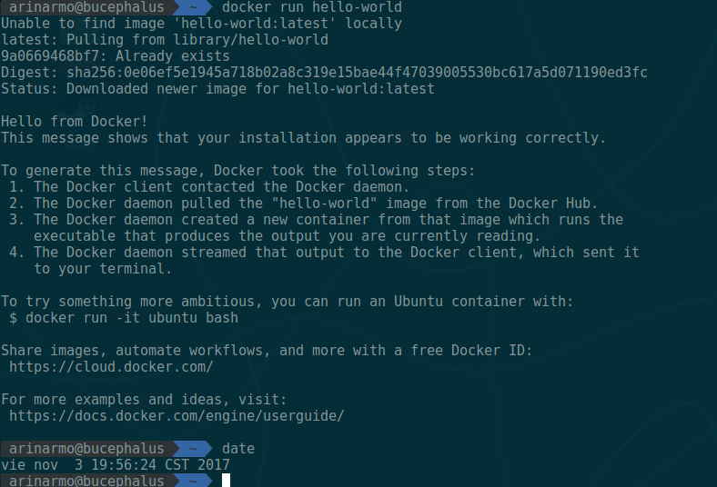

# Instalando docker

## Escogiendo un sistema operativo

Aunque docker está disponible para los SOs más populares, **recomiendo ampliamente** usar una computadora con GNU/Linux. Un ambiente Linux te permite acceder a la mayoría de las herramientas modernas del científico de datos con facilidad, y la comunidad de usuarios de Linux es mucho más activa y dispuesta a ayudar que cualquier otra. Adicionalmente, docker corre nativamente en Linux sin necesidad de activar opciones adicionales, haciendo muy fácil la instalación y preparación de la herramienta.

Si no tienes acceso a una computadora con GNU/Linux y/o no tienes experiencia en el SO, puedes instalar [UbuntuGNOME](https://wiki.ubuntu.com/UbuntuGNOME/GetUbuntuGNOME), de preferencia la versión LTS más reciente. Si no quieres borrar tu SO actual, puedes hacer una [instalación doble](https://www.howtogeek.com/214571/how-to-dual-boot-linux-on-your-pc/). Si no puedes o no quieres instalar Ubuntu, hay opciones en la nube como [AWS](https://aws.amazon.com/) que te dan acceso a un ambiente Linux sin necesidad de instalarlo en tu computadora. Esta opción requiere al menos un [cliente SSH](https://en.wikipedia.org/wiki/Secure_Shell).

Si todo lo demás falla, es suficiente instalar docker en tu Windows o Mac.

## _Links_ de instalación

A continuación los _links_ de instalación para Docker CE.

* [Para Ubuntu](https://docs.docker.com/engine/installation/linux/docker-ce/ubuntu/). Lo mejor es seguir el método de instalación recomendado, a través de apt.
* [Para otros Linux](https://docs.docker.com/engine/installation/), seguir la liga e instruciones correspondientes.
* [Para Mac](https://docs.docker.com/docker-for-mac/install/#install-and-run-docker-for-mac). Leer con cuidado, la instalación depende de tu versión de Mac OS.
* [Para Windows](https://docs.docker.com/docker-for-windows/install/). Hay mucho que tomar en cuenta, dependiendo de tu versión de Windows es probable que necesites usar VirtualBox y/o mover opciones en el BIOS. Esto último puede variar bastante de computadora a computadora. Leer con cuidado.

## Primera tarea

* Lograr una instalación exitosa de Docker CE
* Como evidencia, subir al repo de GitHub, en `programming_for_ds/alumnos/tu_nombre/docker/` una captura de pantalla del resultado correcto al correr `docker run hello-world`, seguida del comando `date`. Tu imagen debe verse como la siguiente:

* Solicitar un _pull request_, poniendo al usuario de GitHub `arinarmo` como _reviewer_.
* Tienes hasta el 9 de noviembre a las 23:59 para entregar esta tarea. Pasada esa fecha, se penalizará la entrega tardía.
